# Proyecto guiado First

## Tiene cuatro activities:
* [Splash](#item1)
* [Login](#item2)
* [Sig Up](#item3)
* [Main](#item4)

### Splash
> https://github.com/6TenYi9/First/blob/master/app/src/main/res/layout/activity_splash.xml
* Que incluye un logo, imagen de fondo y un titulo.
> https://github.com/6TenYi9/First/blob/master/app/src/main/java/com/wei/first/splash.java
* Le asigno el logo y la imagen de fondo con transacción, demás de una animación.
> https://github.com/6TenYi9/First/tree/master/app/src/main/res/anim
* Se abre al iniciar la aplicación, y no se permite volver a atras al pasar de actividad.
> https://github.com/6TenYi9/First/blob/master/app/src/main/AndroidManifest.xml

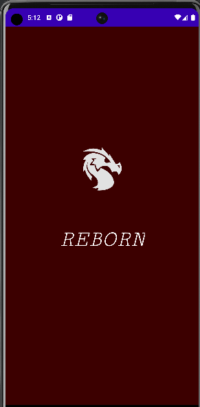
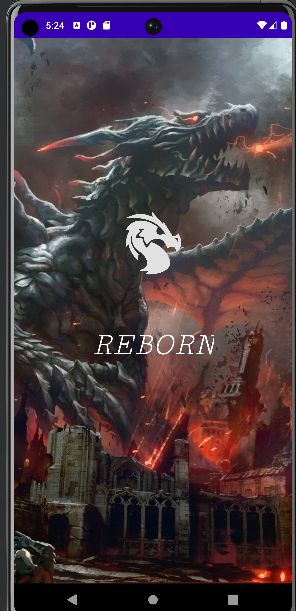

[Subir](#top)

### Login
> https://github.com/6TenYi9/First/blob/master/app/src/main/res/layout/activity_login.xml
* Con user logo, fondo del usuario (como predeterminado un gradiente +), y los botones y inputs necesarios para iniciar sesión.
* Efecto del botón al pulsar: 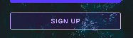
* + gradiente: https://github.com/6TenYi9/First/blob/master/app/src/main/res/drawable/gradient.xml 
+ 
* 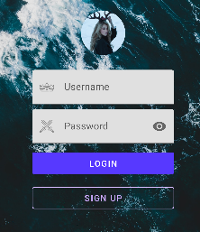
> https://github.com/6TenYi9/First/blob/master/app/src/main/java/com/wei/first/LoginActivity.java
* Asigno las imagenes para el fondo y el logo user, más determinar las acciones de los botones.

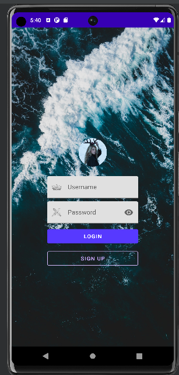
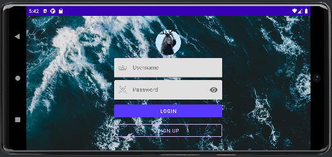

[Subir](#top)

### Sig Up
> https://github.com/6TenYi9/First/blob/master/app/src/main/res/layout/activity_signup.xml
* Con un fondo de color #651A26, logo, más los inputs necesarios para registrarse.

> https://github.com/6TenYi9/First/blob/master/app/src/main/java/com/wei/first/SignupActivity.java
* Establece las acciones de los botones.

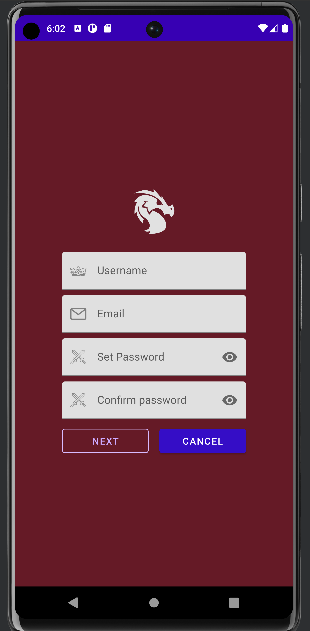
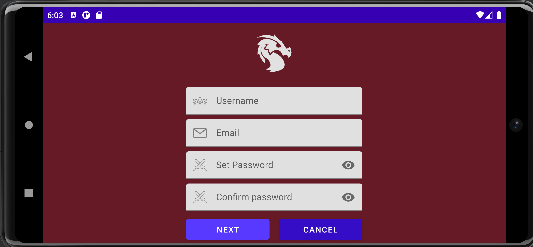

[Subir](#top)

### Main
> https://github.com/6TenYi9/First/blob/master/app/src/main/res/layout/activity_main.xml
* Un WebView para mostrar contenido de una pagina web.
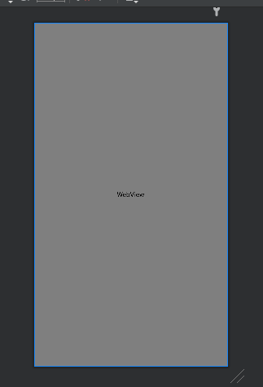
> https://github.com/6TenYi9/First/blob/master/app/src/main/java/com/wei/first/Main.java
* Se introduce un menu con sus acciones y las acciones de refrescar, descargar para la pagina web mostrado...
* 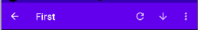
* 
* 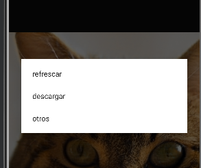
* 
* 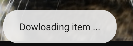
* 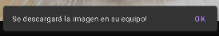

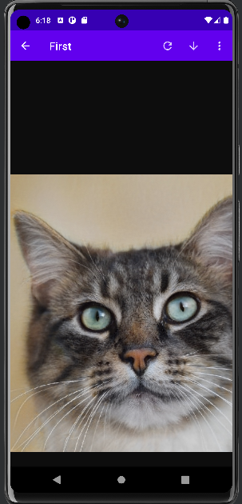
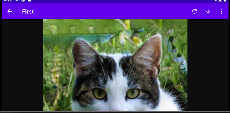

[Subir](#top)
